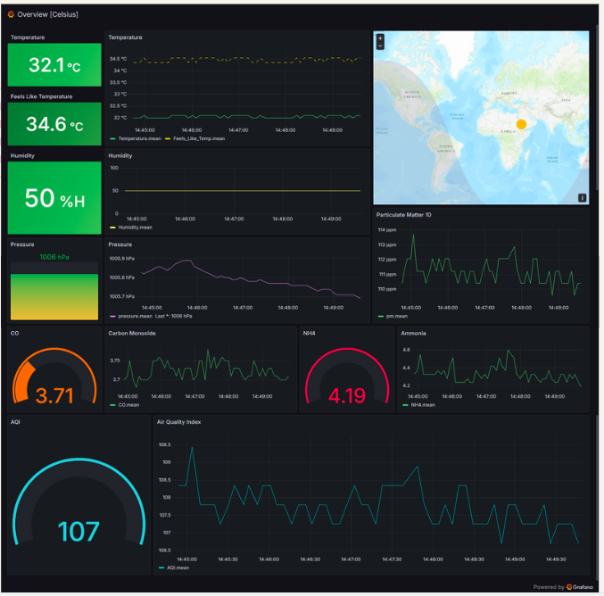

# 🌤️ Weather Monitoring System
<p align="center">
  
</p>


## 📜 Overview
This project presents the development of a **Weather Monitoring System** aimed at collecting, processing, and visualizing environmental data. The system comprises a sensing node equipped with various sensors, an Arduino microcontroller for data acquisition, and a Raspberry Pi 4 serving as a gateway. Communication between the sensing node and the gateway is achieved using a LoRa Radio Module operating at 435MHz. The Raspberry Pi 4 is responsible for transmitting data to a cloud platform.

## ✨ Features
- **Real-time Data Collection**: Collects data from temperature, humidity, and rainfall sensors.
- **Long-range Communication**: Utilizes LoRa Radio Module for communication up to 35km.
- **Cloud Storage and Visualization**: Stores data in an InfluxDB and visualizes it using Grafana.
- **Cost-effective and Scalable**: Designed for affordability and scalability, suitable for various applications.

## 📷 Project Demo


<p align="center">
  <video width="600" controls>
    <source src="video/weather-monitoring-demo.mp4" type="video/mp4">
    Your browser does not support the video tag.
  </video>
</p>

## 🔧 System Components
1. **Sensing Node**: Equipped with DHT11, BMP280, MQ09, MQ135, GP2Y1010AU PM10, Water Sensor, GPS Module, and Light Intensity Sensor.
2. **Central Gateway**: Raspberry Pi 4 with LoRa Radio Module.
3. **Cloud Platform**: Node-RED hosting InfluxDB for data storage.
4. **Data Visualization**: Grafana for interactive graphs and indicators.

## 🚀 Getting Started
### Prerequisites
- Arduino Microcontroller
- Raspberry Pi 4
- LoRa Radio Module
- Sensors: DHT11, BMP280, MQ09, MQ135, GP2Y1010AU PM10, Water Sensor, GPS Module, Light Intensity Sensor
- InfluxDB and Grafana setup

### Installation
1. **Clone the Repository**
    ```sh
    git clone https://github.com/SubodhBawankar/Weather-Monitoring-System.git
    cd Weather-Monitoring-System
    ```

2. **Set Up the Arduino**
    - Connect the sensors to the Arduino microcontroller as per the circuit diagram.
    - Upload the Arduino code to the microcontroller.
    - Install required Libraries 

3. **Configure Raspberry Pi**
    - Set up the Raspberry Pi with the necessary libraries and tools for communication and data transmission.

4. **Set Up Cloud Platform**
    - Install Node-RED and InfluxDB on your cloud platform.
    - Configure Grafana to visualize the data from InfluxDB.

## 📊 Data Visualization


## 🌱 Applications
The Weather Monitoring System can be applied in various fields, including:

- **Agriculture**: Enhancing crop management and climate monitoring.
- **Environmental Monitoring**: Assessing air quality and water resource management.
- **Climate Research**: Collecting data for climate studies and disaster management.
- **Urban Planning**: Supporting infrastructure development and smart city initiatives.
- **Education and Research**: Facilitating academic projects and public awareness.
- **Health Sector**: Monitoring environmental factors affecting public health.
- **Wildlife Sanctuary**: Preserving natural habitats by tracking weather and environmental changes.


## 👥 Contributors
- Aryan Bawankar ([LinkedIn](https://www.linkedin.com/in/aryan-bawankar-306689232))
- Vishwajeet Dhamal
- Devang Shinde
- Avishkar Pagare

## 📄 License
This project is licensed under the MIT License - see the [LICENSE](LICENSE) file for details.

## 🔗 Links
- [GitHub Repository](https://github.com/SubodhBawankar/Weather-Monitoring-System)
- [Project Presentation](https://www.canva.com/design/DAGFUJI9nvk/QkDwIP95_CrYRvoDrs2_Bg/edit?utm_content=DAGFUJI9nvk&utm_campaign=designshare&utm_medium=link2&utm_source=sharebutton)

## 🎉 Enjoy Watching Our Project in Action!
<p align="center">
  
</p>
